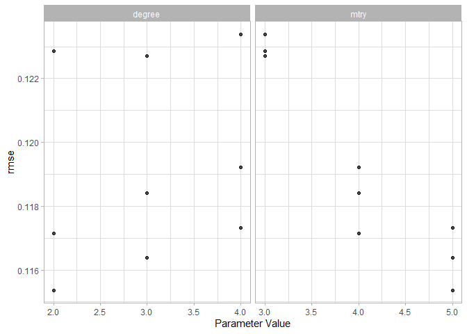

Reproduzindo este
[artigo](https://hansjoerg.me/2020/02/09/tidymodels-for-machine-learning/)
sobre `tidymodels` do [Hansjörg
Plieninger](https://hansjoerg.me/page/about/)

Tutorial on tidymodels for Machine Learning
===========================================

Setup
-----

    library(conflicted)
    library(tidymodels)
    library(tidyverse)
    library(ggrepel)
    library(corrplot)
    library(skimr)

    conflict_prefer("filter","dplyr")

    ggplot2::theme_set(theme_light())

Dataset: `Diamonds`
-------------------

    data("diamonds")

    head(diamonds,10)

    ## # A tibble: 10 x 10
    ##    carat cut       color clarity depth table price     x     y     z
    ##    <dbl> <ord>     <ord> <ord>   <dbl> <dbl> <int> <dbl> <dbl> <dbl>
    ##  1 0.23  Ideal     E     SI2      61.5    55   326  3.95  3.98  2.43
    ##  2 0.21  Premium   E     SI1      59.8    61   326  3.89  3.84  2.31
    ##  3 0.23  Good      E     VS1      56.9    65   327  4.05  4.07  2.31
    ##  4 0.290 Premium   I     VS2      62.4    58   334  4.2   4.23  2.63
    ##  5 0.31  Good      J     SI2      63.3    58   335  4.34  4.35  2.75
    ##  6 0.24  Very Good J     VVS2     62.8    57   336  3.94  3.96  2.48
    ##  7 0.24  Very Good I     VVS1     62.3    57   336  3.95  3.98  2.47
    ##  8 0.26  Very Good H     SI1      61.9    55   337  4.07  4.11  2.53
    ##  9 0.22  Fair      E     VS2      65.1    61   337  3.87  3.78  2.49
    ## 10 0.23  Very Good H     VS1      59.4    61   338  4     4.05  2.39

    # you know: the life, the universer... 
    set.seed(42)

    # training/test
    dia_split <- initial_split(diamonds, prop = .1, strata = price)
    dia_train <- training(dia_split)
    dia_test  <- testing(dia_split)

    dim(dia_train)

    ## [1] 5395   10

    dim(dia_test)

    ## [1] 48545    10

    # cv-folds
    dia_vfold <- vfold_cv(dia_train, v=3, repeats=1, strata=price)

    dia_vfold %>% 
      mutate(df_ana=map(splits, analysis),
             df_ass=map(splits, assessment)) -> folds

Fitando uma RF
--------------

### Modelo: `parsnip`

we use `tune()` as a placeholder and let cross-validation decide on the
best value for `mtry` later on.

    # define the model
    rf_model <- rand_forest(mtry = tune()) %>% #mtry will be tuned
      set_mode("regression") %>% # we'll fit for a value
      set_engine("ranger") # the RF algo

    # check parameters
    parameters(rf_model)

    ## Collection of 1 parameters for tuning
    ## 
    ##    id parameter type object class
    ##  mtry           mtry    nparam[?]
    ## 
    ## Model parameters needing finalization:
    ##    # Randomly Selected Predictors ('mtry')
    ## 
    ## See `?dials::finalize` or `?dials::update.parameters` for more information.

    dials::mtry()

    ## # Randomly Selected Predictors  (quantitative)
    ## Range: [1, ?]

You can either specify the maximum for `mtry` yourself using `update()`,
or you can use `finalize()` to let the data decide on the maximum.

    # setting the mtry range by hand
    rf_model %>% 
      parameters() %>% 
      update(mtry=mtry(c(1L, 5L)))

    ## Collection of 1 parameters for tuning
    ## 
    ##    id parameter type object class
    ##  mtry           mtry    nparam[+]

    # rf_model %>% 
    #     parameters() %>% 
    #     # Here, the maximum of mtry equals the number of predictors, i.e., 24.
    #     finalize(x = select(juice(prep(dia_rec)), -price)) %>% str()
    #     pull("object")

Preparing data for tunning: `recipes`
-------------------------------------

As we create a feature using `step_poly()` we need to decide what are
the best degree, let’s `tune()` this too.

    dia_rec2 <- recipe(price~., data = dia_train) %>% 
      step_log(all_outcomes()) %>% 
      step_normalize(all_predictors(), -all_nominal()) %>% 
      step_dummy(all_nominal()) %>% 
      step_poly(carat, degree = tune())

    dia_rec2 %>% 
      parameters() %>% 
      pull("object")

    ## [[1]]
    ## Polynomial Degree  (quantitative)
    ## Range: [1, 3]

Combine everything: `workflows`
-------------------------------

The workflows package is designed to bundle together different parts of
a machine learning pipeline like a recipe or a model.

    rf_wflow <-
        workflow() %>%
        add_model(rf_model) %>%
        add_recipe(dia_rec2)

    rf_wflow

    ## == Workflow =======================================================================================
    ## Preprocessor: Recipe
    ## Model: rand_forest()
    ## 
    ## -- Preprocessor -----------------------------------------------------------------------------------
    ## 4 Recipe Steps
    ## 
    ## * step_log()
    ## * step_normalize()
    ## * step_dummy()
    ## * step_poly()
    ## 
    ## -- Model ------------------------------------------------------------------------------------------
    ## Random Forest Model Specification (regression)
    ## 
    ## Main Arguments:
    ##   mtry = tune()
    ## 
    ## Computational engine: ranger

Second, we need to update the parameters in `rf_wflow`, because the
maximum of `mtry` is not yet known and the maximum of `degree` should be
four (while three is the default).

    rf_param <-
        rf_wflow %>%
        parameters() %>%
        update(mtry = mtry(range = c(3L, 5L)),
               degree = degree_int(range = c(2L, 4L)))

Third, we want to use cross-validation for tuning, that is, to select
the best combination of the hyperparameters. Grid search will suffice.
To this end, let’s create a grid of all necessary parameter
combinations.

    rf_grid <- grid_regular(rf_param)
    rf_grid

    ## # A tibble: 9 x 2
    ##    mtry degree
    ##   <int>  <int>
    ## 1     3      2
    ## 2     4      2
    ## 3     5      2
    ## 4     3      3
    ## 5     4      3
    ## 6     5      3
    ## 7     3      4
    ## 8     4      4
    ## 9     5      4

Make sure parallel processing and do a grid search

    library(future)

    ## Warning: package 'future' was built under R version 3.6.3

    plan(multicore)

    rf_search <- tune_grid(rf_wflow, grid = rf_grid, resamples = dia_vfold,
                           param_info = rf_param)

    rf_search

    ## #  3-fold cross-validation using stratification 
    ## # A tibble: 3 x 4
    ##   splits              id    .metrics          .notes          
    ##   <list>              <chr> <list>            <list>          
    ## 1 <split [3.6K/1.8K]> Fold1 <tibble [18 x 5]> <tibble [0 x 1]>
    ## 2 <split [3.6K/1.8K]> Fold2 <tibble [18 x 5]> <tibble [0 x 1]>
    ## 3 <split [3.6K/1.8K]> Fold3 <tibble [18 x 5]> <tibble [0 x 1]>

The results can be examined using `autoplot()` and `show_best()`.

    autoplot(rf_search, metric="rmse")

    show_best(rf_search, metric = "rmse",n=9) #top nine

    ## # A tibble: 9 x 7
    ##    mtry degree .metric .estimator  mean     n std_err
    ##   <int>  <int> <chr>   <chr>      <dbl> <int>   <dbl>
    ## 1     5      2 rmse    standard   0.115     3 0.00214
    ## 2     5      3 rmse    standard   0.116     3 0.00223
    ## 3     4      2 rmse    standard   0.117     3 0.00198
    ## 4     5      4 rmse    standard   0.117     3 0.00233
    ## 5     4      3 rmse    standard   0.118     3 0.00250
    ## 6     4      4 rmse    standard   0.119     3 0.00263
    ## 7     3      3 rmse    standard   0.123     3 0.00223
    ## 8     3      2 rmse    standard   0.123     3 0.00197
    ## 9     3      4 rmse    standard   0.123     3 0.00243

    select_best(rf_search, metric = "rmse")

    ## # A tibble: 1 x 2
    ##    mtry degree
    ##   <int>  <int>
    ## 1     5      2

    select_by_one_std_err(rf_search, mtry, degree, metric="rmse")

    ## # A tibble: 1 x 9
    ##    mtry degree .metric .estimator  mean     n std_err .best .bound
    ##   <int>  <int> <chr>   <chr>      <dbl> <int>   <dbl> <dbl>  <dbl>
    ## 1     4      2 rmse    standard   0.117     3 0.00198 0.115  0.118

Selecting the Best Model to Make the Final Predictions
------------------------------------------------------

    # uses the "one-standard error rule" (Breiman _el at, 1984) 
    # that selects the most simple model that is within one standard error
    # of the numerically optimal results.
    rf_param_final <- select_by_one_std_err(rf_search, mtry, degree, metric = "rmse")

    # set 
    rf_wflow_final <- finalize_workflow(rf_wflow, rf_param_final)

    rf_wflow_final_fit <- fit(rf_wflow_final, data=dia_train)
    rf_wflow_final_fit

    ## == Workflow [trained] =============================================================================
    ## Preprocessor: Recipe
    ## Model: rand_forest()
    ## 
    ## -- Preprocessor -----------------------------------------------------------------------------------
    ## 4 Recipe Steps
    ## 
    ## * step_log()
    ## * step_normalize()
    ## * step_dummy()
    ## * step_poly()
    ## 
    ## -- Model ------------------------------------------------------------------------------------------
    ## Ranger result
    ## 
    ## Call:
    ##  ranger::ranger(formula = formula, data = data, mtry = ~4L, num.threads = 1,      verbose = FALSE, seed = sample.int(10^5, 1)) 
    ## 
    ## Type:                             Regression 
    ## Number of trees:                  500 
    ## Sample size:                      5395 
    ## Number of independent variables:  24 
    ## Mtry:                             4 
    ## Target node size:                 5 
    ## Variable importance mode:         none 
    ## Splitrule:                        variance 
    ## OOB prediction error (MSE):       0.01240048 
    ## R squared (OOB):                  0.9880011

Predict
-------

Now, we want to use this to `predict()` on data never seen before,
namely, `dia_test`. Unfortunately,
`predict(rf_wflow_final_fit, new_data = dia_test)` does not work in the
present case, because the outcome is modified in the recipe via
`step_log()`.

Thus, we need a little workaround: The prepped recipe is extracted from
the workflow, and this can then be used to `bake()` the testing data.
This baked data set together with the extracted model can then be used
for the final predictions.

    # recipe from final fit
    dia_rec3 <- pull_workflow_prepped_recipe(rf_wflow_final_fit)

    # engine from final fit
    rf_final_fit <- pull_workflow_fit(rf_wflow_final_fit)

    # predicts using final fit engine with dia_test baked with final recipe
    # add the y_hat to the test dataset
    dia_test$.pred <- predict(rf_final_fit, new_data = bake(dia_rec3, dia_test))$.pred

    # transform the Y into a log 
    # apply metrics
    dia_test %>%
      select(price, .pred) %>% 
      mutate(price.log = log(price)) %>% 
      metrics(truth=price.log, estimate=.pred)

    ## # A tibble: 3 x 3
    ##   .metric .estimator .estimate
    ##   <chr>   <chr>          <dbl>
    ## 1 rmse    standard      0.114 
    ## 2 rsq     standard      0.987 
    ## 3 mae     standard      0.0849
